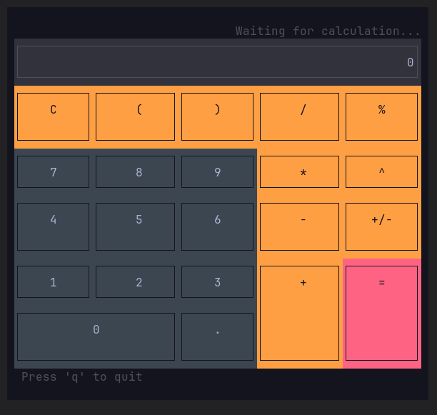

# Rust TUI Calculator



A powerful terminal UI calculator for Linux, written in Rust.

> **Note:** This project was created as a fun experiment by **Ruventium** with the help of a large language model (Google's Gemini AI) to explore the capabilities of Rust for building terminal applications.

## ✨ Features

- **Interactive UI:** A mouse-driven interface that runs directly in your terminal.
- **Keyboard Support:** Control the calculator using your keyboard (`Enter` for `=`, `Backspace`, `Esc` for `C`).
- **Correct Math:** Uses a proper expression parser to handle the correct order of operations (e.g., `2 + 3 * 4` is `14`).
- **Advanced Functions:**
  - Powers (`^`)
  - Percentages (`%`) with context-aware logic
  - Parentheses (`()`)
  - Sign Change (`+/-`)
- **Performance Meter:** Shows how long the last calculation took in microseconds.
- **Modern & Safe:** Built with Rust for speed and memory safety.

## 🚀 How to Build and Run

1.  Make sure you have the **Rust** toolchain installed.
2.  Clone this repository:
    ```bash
    git clone https://github.com/Ruventium/rust-calculator-tui-gemini-test.git
    ```
3.  Navigate into the project directory:
    ```bash
    cd rust-calculator-tui-gemini-test
    ```
4.  Build and run the project in release mode for the best performance:
    ```bash
    cargo run --release
    ```

## 📋 How to Use

-   Use your **mouse** or **keyboard** to operate the calculator.
-   Press the **'q'** key to quit the application.
